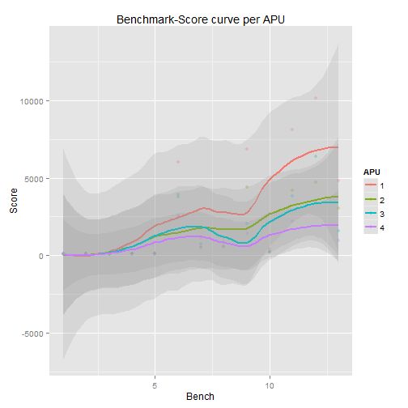

========================================================
<span style="color:white; font-size:2em;">
APU Benchmark Dashboard 
</span>
<br/>
### Luis Urbina
### August 20, 2015
<br/>
### RPres Project
### Development Data Product Course
<br/>
https://luisurbina.shinyapps.io/shiny02


Introduction 
========================================================
<span style="color:dimgray; font-size:.85em;">
The AMD Accelerated Processing Unit (APU) is a series of 64-bit microprocessors from AMD designed to act as a CPU and graphics accelerator
(GPU) on a single chip. AMD and Intel are the largest APU producers in the
world. Their products are used in Desktop and Laptop devices, and customized units are also used in the Sony PlayStation and the Xbox video games.
</span>

<span style="color:dimgray; font-size:.85em;">
The APU performance is determined through diverse Performance Test benchmarks. This presentation shows the benchmark scores for both the 
AMD and the Intel APUs. The data has been generated in the AMD Marketing Laboratory at Austin, Texas, and for confidentiality reasons, the score values has been changed.
</span>


Input Data Table 
===================================
<span style="color:dimgray; font-size:.85em;">
The table shows the AMD APU score for several benchmarks such as 3DMark 
Windows 8.1 and PCMark. 
</span>

```
          Bench  AMD_01 AMD_02
1         Excel   114.0     79
2       Outlook   141.0    130
3        PowerP   126.0    124
4          Word   130.5    118
5      Internet   162.0    103
6    PCM8_Score  6018.0   3800
7     FSA_Score  1119.0    550
8  FSA_Graphics  1192.5    581
9   FSA_Physics  6871.5   4405
10 FSA_Combined   412.5    204
11    CGA_Score  8133.0   4219
12 CGA_Graphics 10125.0   4725
13  CGA_Physics  4816.5   3070
```


Performance Graphics
========================================================
<span style="color:dimgray; font-size:.85em;">
The graphics shows the performance for diferent APU models according 
to several benchmarks suchs as 3DMark Windows 8 and PCMark
</span>
 


Statistics
========================================================
<span style="color:dimgray; font-size:.85em;">
Set up the regression model for the different models of APUs, next are
the intercept and the coefficients.
</span>

```
              Estimate Std. Error   t value
(Intercept)   425.7957  718.14066  0.592914
Bench         371.7160   70.08335  5.303913
APU2        -1327.1923  741.69248 -1.789410
APU3        -1471.2692  741.69248 -1.983665
APU4        -2074.3269  741.69248 -2.796748
```
<br/>
<span style="color:dimgray; font-size:.85em;">
The Shiny project could be reached at:
</span>
<br/>
https://luisurbina.shinyapps.io/shiny02
